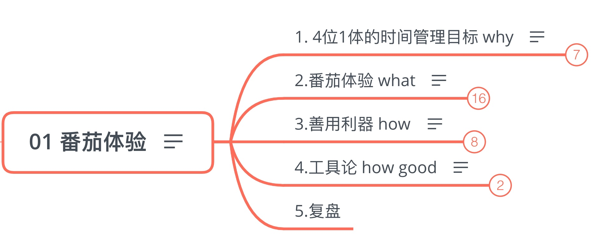

## 01 番茄体验

克服盲目自我感动，克服脉冲式努力
如何度过自己的时间，就是如何度过人生
如何管理自己的时间，决定了生命的价值
你的意志如何，你的力量也必如何
7年完成超3000个番茄，是一种怎样的体验？

### 1. 4位1体的时间管理目标 why

4种状态合二为一，融入自己，融入工作学习生活，让你活成理想中的自己

回答了：为什么要学习番茄工作法

- 4位1体

	- 1.专注时像神人

	  Zen (禅)：虽然忙，大脑专注而耐心，心如止水，忙而不乱

	- 2.休息时像死人

	  学会真正休息和放松，会休息才会工作

	- 3.工作中大忙人

	  有效率，也有效果

	- 4.生活中大闲人　

	  不管多忙，都有自己爱好，生活情趣，有陪伴家人的时间

- 一曝十寒的：脉冲式努力

  猛学两小时奔溃一整天，猛学两三天崩溃一星期。恶性循环

### 2.番茄体验 what

回答了：番茄工作法是什么

- 番茄工作法

  Pomodoro Technique
  Pomodoro 意大利的单词，意思是番茄，一开始是用一个番茄形状的厨房定时器，来执行时间管理的方法
  
  

  
  看似简单，如何做到极致？

	- 25分钟工作/番茄时间，5分钟休息时间
	- 25分钟 = 一个番茄，今天做了8个番茄 = 8*25分钟 的番茄时间
	- 25 + 5 =30 分钟 = 半个钟，这是一个循环
	- 第四次循环时，5分钟(小休息)变成 15分钟(大休息)

- 吃了3000个番茄，是怎样的体验？

	- 不只是个计时器

		- 给自己的目标 量化：多少个番茄
		- 在执行番茄的时候 刻意练习：专注
		- 耐心的刻意练习　　　

	- 打破自我盲目

	  自我感动的精神毒药，感觉身体被掏空，然后放松，遇到挫折还会抱怨社会，在失败中孤芳自赏

	- 怎样的一种体验？

		- 效率翻了好几倍
		- 克服盲目的自我感动
		- *打下时间管理基本功
		  坐功 也变得足够强大(屁股的坐功，可以耐下心)

	- 任何严肃的自我追求，都要靠纯(有效)时间投入

	  1.任何严肃的自我追求，都要靠纯(有效)时间投入
	  2.任何严肃追求个人成长和自我实现的人，都需要1000个番茄的锤炼
	  (甚至，每年给个人成长〔拨款〕1000个番茄)

### 3.善用利器 how

回答了：怎么选番茄app？

学习者，创造者对工具的使用原则
要明白：工具的价值是什么？
服务人，不绑架，不为了体验工具而使用工具，而是善用利器，让工具为我所有
筛选原则：
1.不纠结(对我好就行)
2.不浪费(不浪费时间在选工具上当工具癖)
3.知道做到(不在于选到最好的神器，而在于把利器用到极致)

- 什么样的番茄app才是好的？

  本质：好的番茄app，ta的黄金标准是什么？

	- 黄金3标准

		- 分项目统计
		- 简洁有效的数据反馈
		- 培养内在节奏感

- 选择哪个番茄app？

	- Focus Time

	  孤独者的番茄

	- Forest

	  别那么苦  的番茄，最可爱，最好玩

### 4.工具论 how good

如何处理人与 工具的关系？
善用利器，克制，极致

- 克制&极致

  克制：在术与器的层面克制
  只关系核心的，帮你解决问题的。
  
  极致：在道与法的层面极致
  实践，思考强度，解决问题上极致。

- 喜欢就会放肆，爱是克制

### 5.复盘

