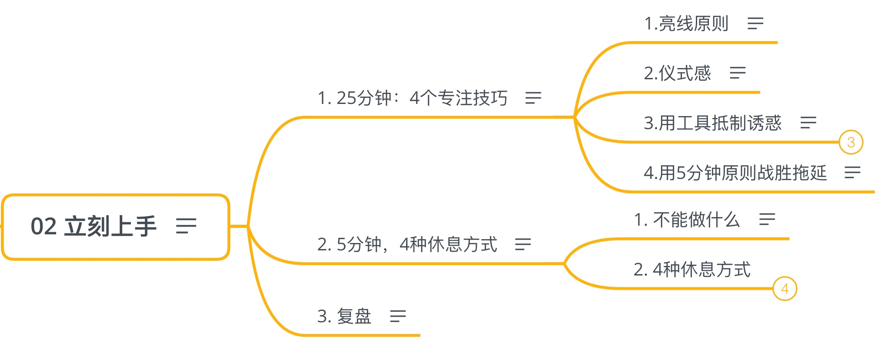
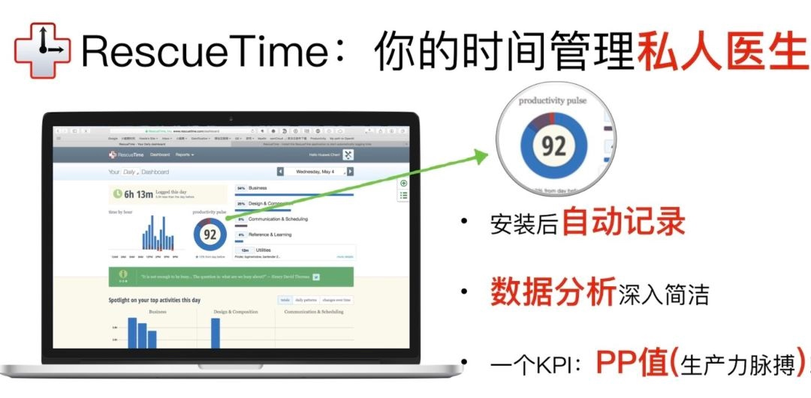
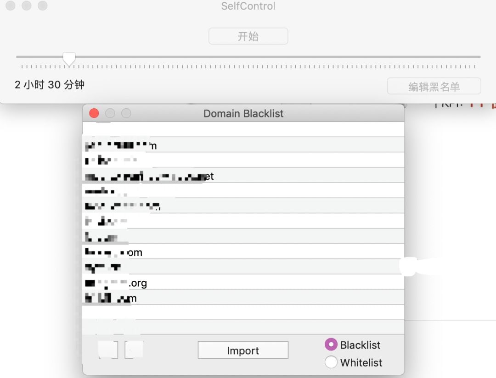
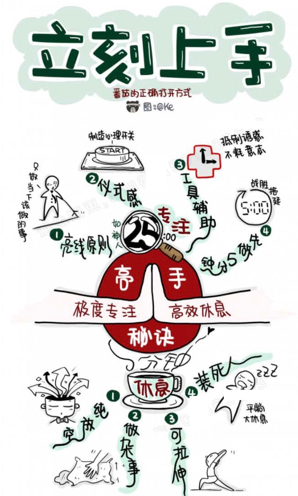
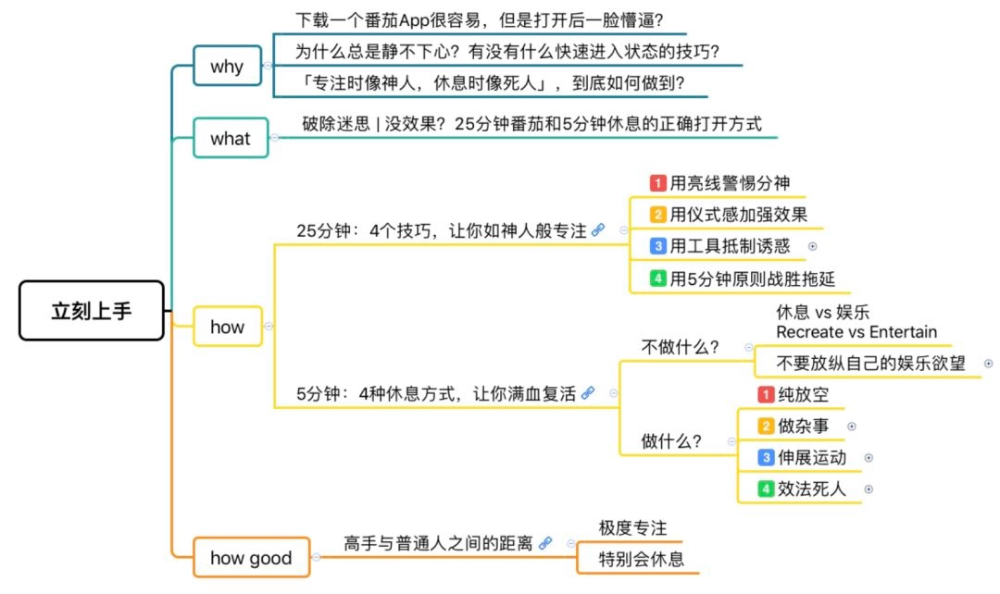

## 02 立刻上手

静不下心？why
25分钟专注和5分钟休息的正确打开方式 what

### 1. 25分钟：4个专注技巧

让你如神人般专注
how

- 1.亮线原则

  亮线：西方律师圈子的行话，意：清晰，简洁，绝不模糊的规则
  例：戒烟，不是少抽点，而是一根不抽
  这个规则就是亮线
  除了要做的事，其他的都不做
  不做当下该做的事就是拖延

- 2.仪式感

  用仪式感加强效果
  用一些特殊的动作进入专注状态，如：听巴赫大提琴无伴奏
  其他：
  电影whiplash 原声带
  dirty three 的 《ocean songs》

- 3.用工具抵制诱惑

  设置逻辑：
  1.保持早上精力最好的是时段，避免分心
  2.抑制晚上精力最差的时段，避免沉迷娱乐
  
  规则：早9点开始，晚10点以后

	- RescueTime

	  可以设置哪些网站不可以访问，Mac
	  
	  

	- self control

	  可以设置哪些网站不可以访问，Mac
	  
	  

	- Freedom

	  window下的同类软件

- 4.用5分钟原则战胜拖延

  不管3 7还是21，直接做5分钟再说，万事开头难，坚持

### 2. 5分钟，4种休息方式

Beatles 《sleep like a log》睡得像跟木头一样
娱乐的暴饮暴食，并不能填补被掏空的精神
4种休息方式，让你满血复活

- 1. 不能做什么

  逆向思维，这里先不谈不能做什么，先谈能做什么：
  不是为了赶紧娱乐，而是休息后恢复高效专注的状态，重新恢复生产力

- 2. 4种休息方式

	- 1.纯放空

	  放下手机，离开电脑，看看窗外，喝口水，上卫生间

	- 2.做杂事

	  做家务，工作中的杂事碎事
	  贴发票报销

	- 3.伸展运动

	  做运动舒展身体，做眼保健操
	  
	  心灵固然愿意，肉体却软弱了
	  ——《马太福音》

	- 4.效法死人

	  趟下，调整呼吸，平静内心，快速让身体和心理恢复最佳状态
	  
	  每一个效率爆表的知识工作者，都有一个默默支持ta的番茄

### 3. 复盘

5分钟休息比25分钟更重要
没有5分钟的休息就没有25分钟的高效
25分钟，5分钟，滴答滴答，形成自己的节奏，张弛有度，身体内的节奏感，就是番茄的精髓

how good 
高手与普通人的距离：
1.极度专注，2.特别会休息

