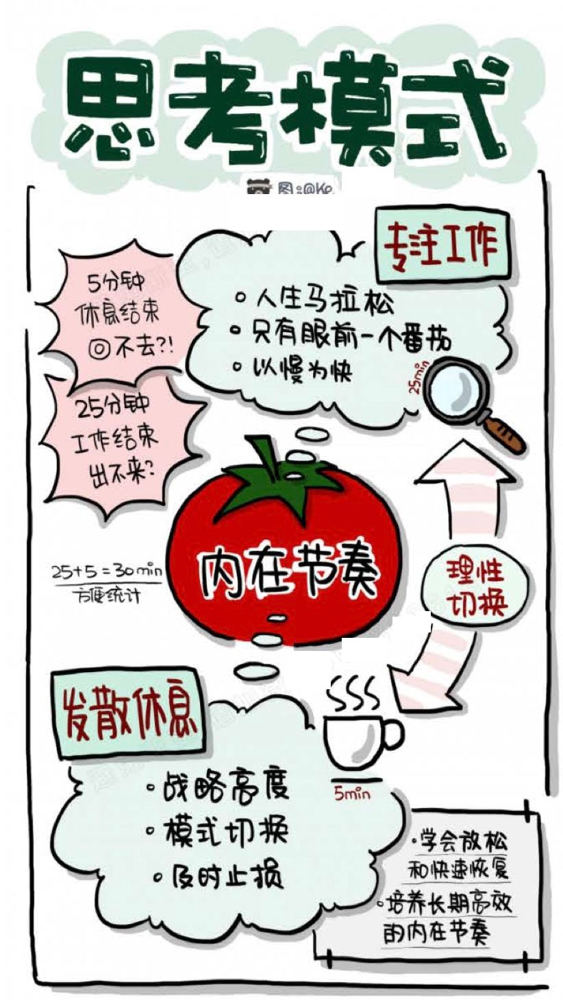

## 03 番茄进阶

### 1. 5分钟休息后回不去？

- 番茄的工作和休息如何切换？

  本质是5分钟休息时间出了问题，理解/执行不到位
  5分钟休息，对培养长期高效所需的内在节奏感至关重要
  

	- 解决方案：将番茄5分钟休息提高到战略高度
	- 人脑思维模式

		- 专注模式

		  全情投入，心无旁骛
		  对应：25分钟
		  Focus Mode

		- 发散模式　

		  在放松和休息中发酵思想，迸发灵感和解决方案
		  对应：5分钟
		  Diffused Mode
		  
		  5分钟休息，也是[及时止损]的机制
		  有了番茄，如果你遵守番茄的规则，你 最多走神25分钟，因为番茄会提醒你休息
		  这个25分钟效率不高，但是有个5分钟休息切换，就可以从低效中拯救出来

### 2. 25分钟工作后跳不出来？

25分钟到了，没注意到/还想继续工作，不想休息
总觉得25太短？自己一专注就2小时？

- 如何看待自己的学习和工作？

	- 百米冲刺

	  一鼓作气，再而衰，三而竭

	- 人生马拉松

	  哪怕千军万马，我只要斩杀眼前一人
	  ——日本剑道高手，宫本武藏《五轮书》

- 培养内在节奏

	- 纯脑力高强度番茄活动，一天做10个就够了
	- 培养长时间高效工作的内在节奏感
	- 莫要三天打鱼两天撒网

	  因为没用番茄去定量管理

### 3.为什么是25+5？

25+5 = 30 ，30 * 2番茄 = 60 = 1h
除了张弛有度，还便于统计
不要把5分钟排除出去，因为25分钟，5分钟都太重要了

### 4.复盘

- 25分钟专注很重要
- 5分钟休息同样重要
- 把5分钟休息提升到战略高度

培养人生马拉松的长期节奏感，而不是一鼓作气，再而衰，三而竭。

