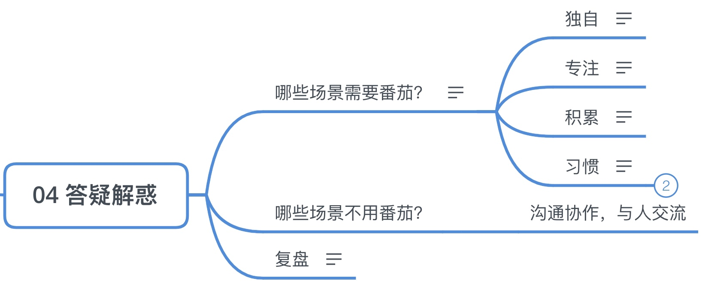
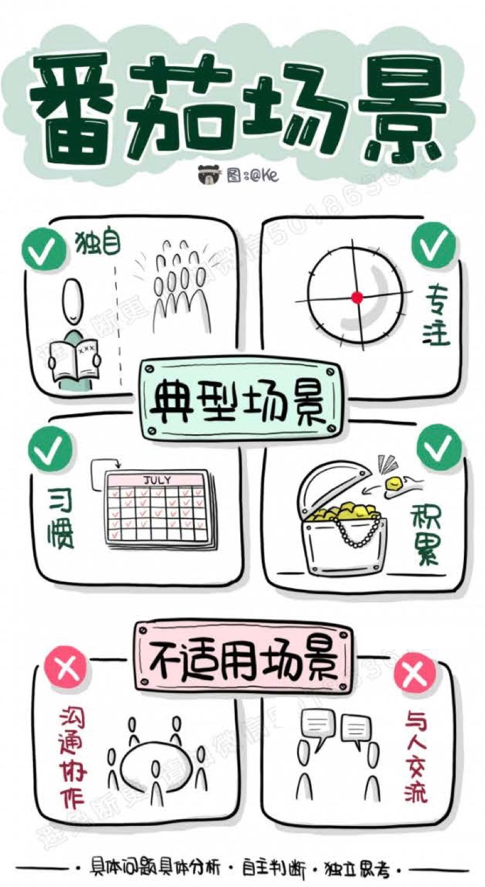
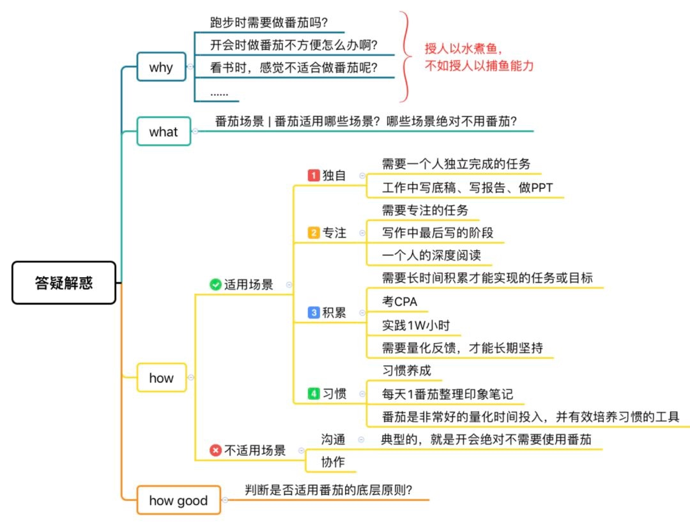

## 04 答疑解惑

### 哪些场景需要番茄？

适用番茄的场景
8字概括：独自，专注，积累，习惯

#### 独自

一个人独立完成的任务，写报告，做ppt

#### 专注

需要专注的任务，写作，学习备考，写报告
if需要专注，then 用番茄

#### 积累

需要靠有效纯时间积累才能够实现的任务或者目标
如：考研，高考等入学考试，司法考试，医师资格证等资格考试
  
或者，给自己定了目标：成为xxx领域的专家
然后自己去实践：1万小时理论，这时候就需要番茄的陪伴
基于番茄的节奏，以番茄的最小量化单位，给自己的目标实现简历有效的量化和反馈机制
离终点还有多少个番茄，能不能顺利到达终点

#### 习惯

需要养成新习惯的场景
如：学完：知识管理训练营课程，要养成让努力可积累，每天做知识管理
每天用一个番茄的时间去整理印象笔记

- 基于番茄和日历的习惯养成技巧

  给自己选择1-2个最想养成的习惯，如：每天话1个番茄看本闲书，每天花个番茄练习冥想，每天花个番茄背单词
  挑一本好看的日历，放床头/书桌，每天都方便看到的地方
  每天只要达成目标，就用彩笔把当天日历涂黑，没达到就空着
  看看可以连涂黑几天

- 涂日历，创造连击的好处

  从抽象到具体：每天可以看到不断提醒的具体的被涂黑的日历
  从模糊到明确：更符合[亮线原则]，不但规定了时长，更规定了必须专注，给学习实践加了质量维度
  不求完美，但求积累：即使断了几天，也没关系，日历会把过去的积累展现在面前。人是天然要[保持一致]的动物，过去愈好，即将到来的将来也会变得更好

### 哪些场景不用番茄？

- 沟通协作，与人交流

### 复盘

今天的内容很简单，总结一下：

现实世界是丰富多彩的，潜在的适用或不适用番茄的场景是无穷的。
唯一的方法就是：
掌握适用不适用番茄的原则，就是 8 个字：独自、专注、积累、习惯；
具体问题具体分析，自主判断，独立思考；

祝你吃番茄愉快。

