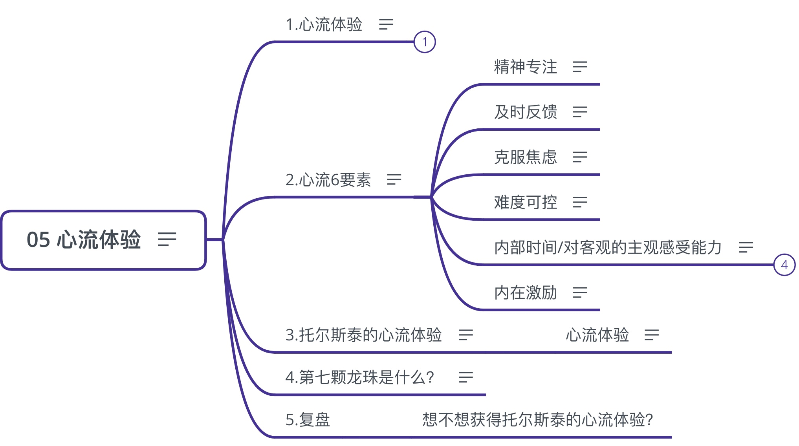

## 05 心流体验

进入`心流`，小番茄让你沉迷工作学习无法自拔!

### 1.心流体验

flow experience：抛弃枯燥僵化的学术定义，
用人话说就是：做事情全情投入，全然忘了时间流逝，沉浸其中，甚至忘了吃饭喝水的生理需求，专注高效的状态
不疯魔何以成佛

新流体验/Flow，校验番茄的唯一标准

- 好处

  在新流状态，一切浑然天成，事情毫不费力，轻松完成
  梦想重的工作和学习场景
  如何获得新流体验？
  番茄工作法，自带创造新流的属性，堪称强大的新流制造机

### 2.心流6要素

米哈里，心流之父，第一个提除心流概念并以科学方法加以探讨的西方科学家，树立了心流状态所需要的六大要素

#### 精神专注

龙珠1：精神专注
番茄的25分钟，为纯数量计量的时间引入的质量维度，帮助我们实现专注

#### 及时反馈

龙珠2：及时反馈

喜欢玩游戏，不喜欢学习，是因为学习之后要等考试才会反馈出来，而游戏有迅速反馈机制
而番茄，会有反馈，你可以看到自己向目标前进了，而且是非常扎实的

#### 克服焦虑

  龙珠3：克服焦虑
  也就是进入忘我状态，不焦虑
  
  焦虑的对立面，不是没有焦虑，而是没有行动，是拖延。
  番茄会斩断：焦虑-拖延-焦虑 的恶性循环
  
  番茄可以克服焦虑，因为番茄带动行动，而且是最小单位，立刻落地的行动变化和行为改变

#### 难度可控

  龙珠4：难度可控
  个人能力和任务强度要匹配
  
  正确的难度：
  不太难，也不太容易
  可克服的难度，稍微超出当前能力水平，努力一下就能够得着的难度，引导我们走出舒适区

#### 内部时间/对客观的主观感受能力

  时间无感症：
  一不小心一年过去了，一天，一小时，一星期过去了，而且你想不起来你到底干了啥
- 对客观的主观感受能力
- 时间
  时间是永恒的，但需要一分为二
	- 外部时间
	  外部时间是永恒的，对于宇宙来说，人生命的长度不值一提
	- 内部时间
	  对于人的内部时间，你去考虑那个永恒的时间有什么意义？这就是为什么我们要珍惜时间，内部时间有限！
	  时间是个常量，也是个变量。
	  对勤奋的人，可以无穷大。
	  对懒惰的人，可以无穷小。	  
	  善用时间，就可以完成更多想做的事情，可比别人拥有很多个人生
    
#### 内在激励

  做自己真正想做的事情

### 3.托尔斯泰的心流体验

《安娜·卡列尼娜》主人公，列文(贵族，地主，知识分子)
参与农耕劳作时割草时获得的心流体验

- 心流体验

  什么也不想，什么也不乞求
  耳朵只听到(镰刀割草的嚓嚓声)
  眼睛只看见(在镰刀刀口下像波浪似的慢慢倒下去的青草花个花序，以及前方的尽头——割到那就可以休息了)
  
  列文完全失去了时间概念，不知道现在是早晚，劳动使他改变，感到十分愉快
  劳动过程中，有时竟忘记了自己在做什么，只觉得轻松愉快
  
  列文，割草的时间越长，就越频繁处于忘我状态，仿佛不是自己手在挥动镰刀，而是镰刀本身变成了充满意识和生命的肉体在运动
  
  仿佛施了魔法似的，不用思索，活儿就会有条不紊，干净利落的自动完成，这是最幸福的时刻
  
  听着像是鸡汤，洗脑，但是人全情投入，确实会有这种状态，就像 顿悟~

### 4.第七颗龙珠是什么？

是你自己！

一个人，最伟大的产品，莫过于自己的一生
找到这种感觉，找到你自己，把自己打造成一生的终极产品，这才是时间管理，找到心流的终极武器!

### 5.复盘

- 想不想获得托尔斯泰的心流体验？

### 6.补充阅读资料

- [善用良器：帮你有效管理时间的 7 种武器](http://t.cn/R17s1e7)
- [电影片段《安娜 · 卡列尼娜》(1997)，托尔斯泰的心流](http://t.cn/R1hGi4h)
- [短视频 The Origin of Time，讲的大概是「对客观时间的主观感受」，或者是在卖某个奇奇怪怪的东西](http://t.cn/R1I4Y65)

