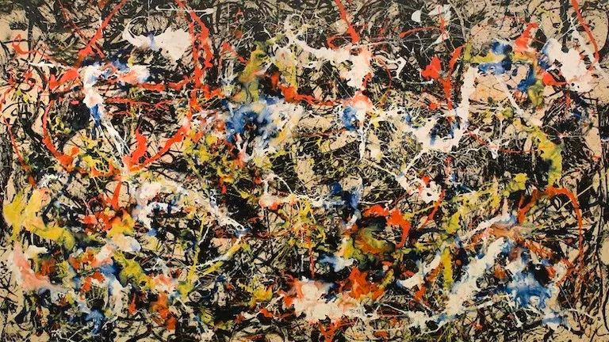

## 06 刻意练习

战胜混乱失控，小番茄帮你重建时间内在秩序！

### 1.质问：你是机器人吗？

学习时间管理，天天做番茄，虽然效果好，但是我担心自己变成机器人。
你怎么看时间管理的[秩序]和[混乱]状态？
你到底希望像机器人那样工作，还是像人类中的大师那样工作？

### 2.真正的大师，如何工作？

大v认为：大师是[反秩序]的，大师的艺术杰作超越秩序，在混乱中让创造力勃发出来
所谓秩序，只是普通人你的自我心理安慰，把桌面整理整洁，电脑温暖车归类有序，实际上大师是不齿此类行为的

真的如此？
普通人如何才能不像机器人，而像人类大师那样工作？

#### 普通人如何才能不像机器人，而像人类大师那样工作？

  大师看起来混乱，但那是[创造性混乱]，而且是引入了秩序的基础上，有意识的引入混乱

#### 大师的混乱到底是哪一种混乱？
举例子

- 毕加索

    秩序期：16岁的作品，把古典画玩到了极致
    
    
    
    混乱期：64岁的作品
    大师的混乱，是驾驭秩序后有意引入的创造性混乱
    我们的混乱，是逃避秩序前无力掌控的毁灭性混乱

- 波拉克

    美国抽象派画家：jackson pollock
    他的绘画就像[泼墨]
    

    
    但实际上，波拉克很年轻的时候就能够[像照相机那样作画]
      
    人到中年有一定积累的时候，才能够突破艺术表面秩序，引入我们所看到的混乱和随性
      
    所以你看，波拉克的画作，看起来是胡闹，
    但本质上，他完全驾驭了秩序，每一个作品都蕴藏这完美的 [分形] (fractal)，
    整个泼墨的优化，从那个整体到部分到细节，
    都一以贯之，用秩序创造美感的分形
    
    

    

- 大自然和宇宙的混乱和秩序

    宇宙始于大爆炸，始于混乱，始于[Big Bang]
    生命伴随秩序产生，而宇宙将最终寂灭与熵 的最大值，当 熵 到达 最大值，宇宙一定会死于 混沌
      
    生命从混沌中来，走向秩序，最终回归混沌。
    混沌的状态就是寂灭和死亡。
    生命的美好和丰富多样，都是来自于秩序。
  
一切多样的，精妙美妙的东西，高于寂灭，高于死亡的东南关系，都是建立在秩序的基础之上

### 3.毁灭性混乱 vs 创造性 混乱

#### 3.1混乱分类

- 创造性混乱

大师，已经驾驭了普通人的毁灭性混乱

- 毁灭性混乱

普通人，驾驭普通混乱，自我引入 内在秩序，进入 [工匠] 阶段
刻意练习，精益求精，一丝不苟
  
最后，在创造和创新 过程中，有意识 引入混乱元素，
打破秩序可能带来的僵化和古板。
  
当 他 [重新像个孩子一样] 调皮，他就是一个 [艺术家] 了。
  
这个混乱，是驾驭秩序驾驭秩序基础上 的 [创造性混乱]
  
普通人 -> 工匠 -> 艺术家
毁灭性混乱 -> 内在秩序 -> 创造性混乱
这是一个人的自我突破之旅

#### 3.2时间管理的混乱和秩序

时间管理上，如何看待混乱和秩序的关系？
  
一曝十寒？猛学->崩溃->猛学 的无限循环？

- 秩序

  给自己内在时间建立秩序，
  形成自己长期高效的秩序，
  张弛有度的节奏，打造体内的效率生物钟
  将番茄钟，内化成自己的效率生物钟：滴答滴答形成自己的节奏，陪伴你，度过独特的一生

#### 3.3在限制中，大师得以施展

  不用担心成为机器人，大师都需要帮自己建立内在秩序，工具和过程。
  任何大师，只要驾驭规律，才能实现自由

- 你会不会因为使用番茄工作法而成为机器人

	- 歌德的回答

	  Gothe 《自然与艺术》
	  

	  
	  放荡不羁的精神，
	  企图实现纯粹的崇高，
	  只能白费力气，
	  兢兢业业才能成就大事。
	  在限制中，
	  大师得以施展
	  能给我们自由的唯有规律

### 4.复盘

驾驭混乱，建立内在秩序。
混乱和秩序的争论，要通过现象看本质；

